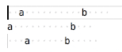

# cursor-trim

Trims whitespace around the cursor(s).

## Features

Trim whitespace to the left and/or right of all cursors/selections.

## Extension Commands

 Command                         | Description
---------------------------------|-------------
`yo1dog.cursor-trim.lTrimCursor` | Trims whitespace to the left.
`yo1dog.cursor-trim.rTrimCursor` | Trims whitespace to the right.
`yo1dog.cursor-trim.trimCursor`  | Trims whitespace to the left and right.

## Implementation Details

**Note:** A "cursor" is actually a selection with a length of 0.

Deletes all consecutive spaces and tabs directly preceding (left trimming) and/or proceding (right trimming) each selection.

## Known Issues

See [Issues](https://github.com/yo1dog/vscode-cursor-trim/issues).

## Release Notes

See [CHANGELOG.md](CHANGELOG.md)